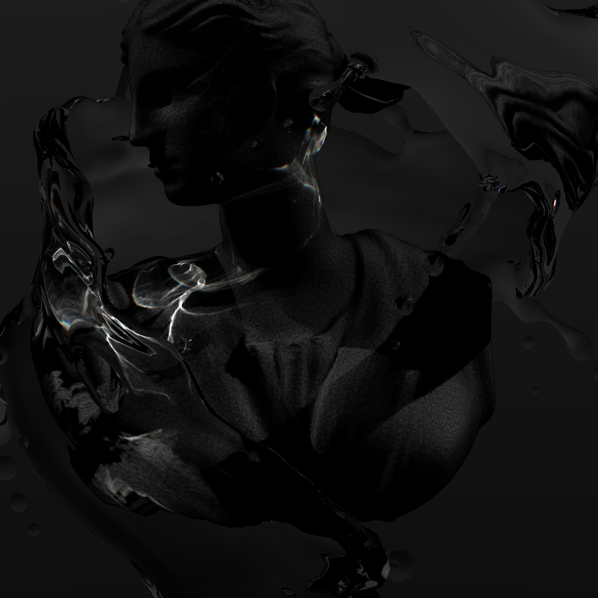

# SPLAT: Speedy Photon Linear Approximation Tracer

## Quick Facts

SPLAT is a [spectral](https://en.wikipedia.org/wiki/Spectral_rendering) Ray Tracer...

1. Written in pure Julia
2. Runs on Nvidia GPUs using [CUDA.jl](https://github.com/JuliaGPU/CUDA.jl)
3. Runs in real time (barely)
4. Uses automatic differentiation (AD) to approximate nearby rays! This is useful for perfomance, and helps produce [caustics](https://en.wikipedia.org/wiki/Caustic_(optics))! In the literature this technique is referred to as 'Photon Splatting'.

## Example Output

In the following examples we see direct light sources cast shadows and caustics onto smooth, diffuse surfaces after passing through a glass-like material.

### Gorgeous but not real time

Here's a scene...

... frozen for detail

### Real Time

Simpler scenes under 10k triangles can run on "low" settings at 20-30 FPS, 1 Megapixel per frame.

## Project Status and Goals

This is a hobby project of three stages
1. "Can I use Julia's AD functionality to implement photon splatting on GPUs?" _Yep, next_
2. "This actually might be able to run in real time. How far can I take this?" _Probably further than I should've._
3. TODO: I would like to clean this up from my hobby blob and make it a package that can downloaded and tinkered with. As a person with a full time job, this has proven elusive so far.
 

### Non-goals

1. Non-trivial surface materials
2. Use RTX tech / Optix.

